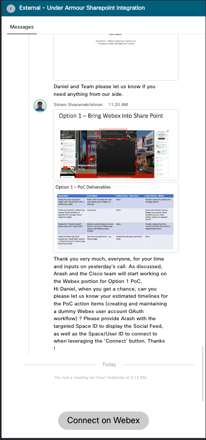

<!-- PROJECT LOGO -->
<br />
<p align="center">
  <h2 align="center">SharePoint Webex Space Integration</h2>

  <p align="center">
  Embed Webex Space Widget inside UA Sharepoint Portal
    <br />
    <a href="https://github.com/WXSD-Sales/sharepoint-space-widget"><strong>Explore the docs »</strong></a>
    <br />
    <br />
    <a href="https://wxsd-sales.github.io/sharepoint-space-widget/">View Demo</a>
    ·
    <a href="https://github.com/WXSD-Sales/sharepoint-space-widget/issues">Report Bug</a>
    ·
    <a href="https://github.com/WXSD-Sales/sharepoint-space-widget/issues">Request Feature</a>
  </p>
</p>

<!-- TABLE OF CONTENTS -->
<details open="open">
  <summary>Table of Contents</summary>
  <ol>
    <li>
      <a href="#about-the-project">About The Project</a>
      <ul>
        <li><a href="#url-examples">URL Examples</a></li>
      </ul>
    </li>
    <li>
      <a href="#getting-started">Getting Started</a>
      <ul>
        <li><a href="#installation">Installation</a></li>
      </ul>
    </li>
    <li><a href="#contributing">Contributing</a></li>
    <li><a href="#license">License</a></li>
    <li><a href="#contact">Contact</a></li>
  </ol>
</details>

<!-- ABOUT THE PROJECT -->

 *_Everything included is for demo and Proof of Concept purposes only. Your use of the site is solely at your own risk. This site may contain links to third party content, which we do not warrant, endorse, or assume liability for. These demos are for Cisco Webex usecases, but are not Official Cisco Webex Branded demos._
 
## About The Project

To display two space widgets in a single web application. One widget to only display the content and messages being sent in a targeted space (SPACE_DESTINATION) and the other space widget to allow the user
with a valid ACCESS_TOKEN to chat with an agent** (AGENT_EMAIL_ADDRESS) by clicking on `Connect On Webex` button. After clicking on `Connect On Webex` button, the user will automatically get redirected to Webex Desktop application to chat with an agent.

** skipping this parameter will hide the `Connect On webex` button.

Note that there are some URL parameters that need to be passed before running this PoC.

| Parameters       | Description                                                                                                                       | Default Value         | Required |
|------------------|-----------------------------------------------------------------------------------------------------------------------------------|-----------------------|----------|
| accessToken      | Valid access token that can be retrieved in [here](https://developer.webex.com/docs/getting-started#accounts-and-authentication ) | <YOUR_ACCESS_TOKEN>   | Yes      |
| spaceDestination | Valid space ID to display the view-only widget                                                                                    | <SPACE_ID>            | Yes      |
| agent            | Valid email address to chat with                                                                                                  | <AGENT_EMAIL_ADDRESS> | No       |
| displayTextBox   | To convert the read-only mode space back to read-write mode                                                                       | no                    | No       |

</br >

<!--  -->

</br >

### URL Examples
Example #1 - to render a read-only space widget with the button to chat with an agent

```
https://wxsd-sales.github.io/sharepoint-space-widget/?accessToken=<YOUR_ACCESS_TOKEN>&spaceDestination=<TARGETED_SPACE_ID>&agent=<VALID_EMAIL_ADDRESS>
```

Example #2 - to render a read-write space widget with the button to chat with an agent

```
https://wxsd-sales.github.io/sharepoint-space-widget/?accessToken=<YOUR_ACCESS_TOKEN>&spaceDestination=<TARGETED_SPACE_ID>&agent=<VALID_EMAIL_ADDRESS>&displayTextBox=true
```

Example #3 - to render a read-write space widget **without** the button
```
https://wxsd-sales.github.io/sharepoint-space-widget/?accessToken=<YOUR_ACCESS_TOKEN>&spaceDestination=<TARGETED_SPACE_ID>&displayTextBox=yes
```

<!-- GETTING STARTED -->

## Getting Started

If you would like to contribute to our source code and to improve our demo, please follow the steps mentioned below:

### Installation

1. Clone the repo
   ```sh
   git clone https://github.com/WXSD-Sales/sharepoint-space-widget.git
   ```
2. We use NVM to manage our node.js machine versioning. You can learn more about NVM [here](https://github.com/nvm-sh/nvm)
   ```sh
   nvm use
   ```
3. Install the packages via [Yarn](https://classic.yarnpkg.com/en/)
   ```sh
   yarn
   ```
4. Start the server
   ```sh
   yarn start
   ```
5. This app requires some environment variables - env default template file is provided.

<!-- CONTRIBUTING -->

## Contributing

Contributions are what make the open source community such an amazing place to be learn, inspire, and create. Any contributions you make are **greatly appreciated**.

1. Fork the Project
2. Create your Feature Branch in your forked repo (`git checkout -b myrepo/AmazingFeature`)
3. Commit your Changes (`git commit -m 'Add some AmazingFeature'`)
4. Push to the Branch (`git push origin myrepo/AmazingFeature`)
5. Open a Pull Request

<!-- LICENSE -->

## License

Distributed under the MIT License. See `LICENSE` for more information.

<!-- CONTACT -->

## Contact

wxsd@cisco.external.com

<!-- MARKDOWN LINKS & IMAGES -->
<!-- https://www.markdownguide.org/basic-syntax/#reference-style-links -->

[contributors-shield]: https://img.shields.io/github/contributors/WXSD-Sales/sharepoint-space-widget.svg?style=for-the-badge
[contributors-url]: https://github.com/WXSD-Sales/sharepoint-space-widget/graphs/contributors
[forks-shield]: https://img.shields.io/github/forks/WXSD-Sales/sharepoint-space-widget.svg?style=for-the-badge
[forks-url]: https://github.com/WXSD-Sales/sharepoint-space-widget/network/members
[stars-shield]: https://img.shields.io/github/stars/WXSD-Sales/sharepoint-space-widget.svg?style=for-the-badge
[stars-url]: https://github.com/WXSD-Sales/sharepoint-space-widget/stargazers
[issues-shield]: https://img.shields.io/github/issues/WXSD-Sales/sharepoint-space-widget.svg?style=for-the-badge
[issues-url]: https://github.com/WXSD-Sales/sharepoint-space-widget/issues
[release-shield]: https://img.shields.io/github/package-json/v/WXSD-Sales/sharepoint-space-widget
[release-url]: https://github.com/WXSD-Sales/sharepoint-space-widget/releases
[license-shield]: https://img.shields.io/github/license/WXSD-Sales/sharepoint-space-widget.svg?style=for-the-badge
[license-url]: https://github.com/WXSD-Sales/sharepoint-space-widget/blob/master/LICENSE.txt
[linkedin-shield]: https://img.shields.io/badge/-LinkedIn-black.svg?style=for-the-badge&logo=linkedin&colorB=555
